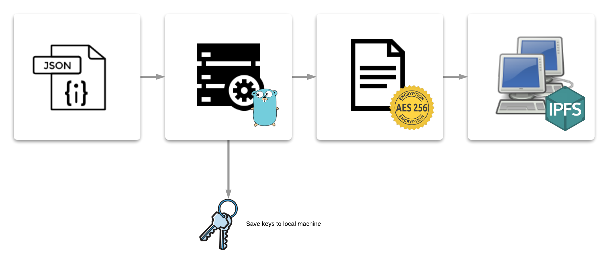

# go-aes-ipfs-server

Simple server that connects to existing IPFS node at localhost:5001 then writes json payloads to IPFS after being encrypted with AES128-AES256 and saves the keys to the local machine.

1. Run go-ipfs
2. Make sure you can connect to `http://localhost:5001` as an IPFS gateway
3. Start encryption sever at `http://localhost:6256`

## Workflow



## Encrypt
```

http://localhost:6256/encrypt

curl --request POST \
  --url http://localhost:6256/encrypt \
  --header 'content-type: application/json' \
  --data '{
        "text": "you cant see me!"
}'

```

## Decrypt
```

 http://localhost:6256/decrypt


curl --request POST \
  --url http://localhost:6256/decrypt \
  --header 'content-type: application/json' \
  --data '{
        "address":"QmZQZ4xdjAWminv28MuGBPAvofqkwquk9kUrdzFitxbcMt",
        "keys": {
                "text": "F/vY63lArqf2rr3ADAz2tE7mKmIRmRkzi3V5+ouHSIs="
        }
}'

```
